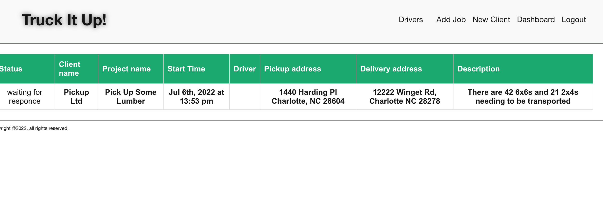
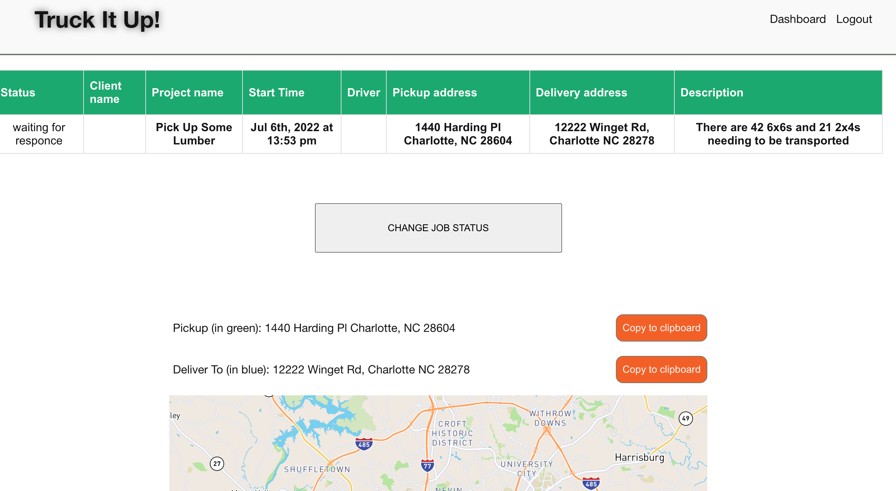
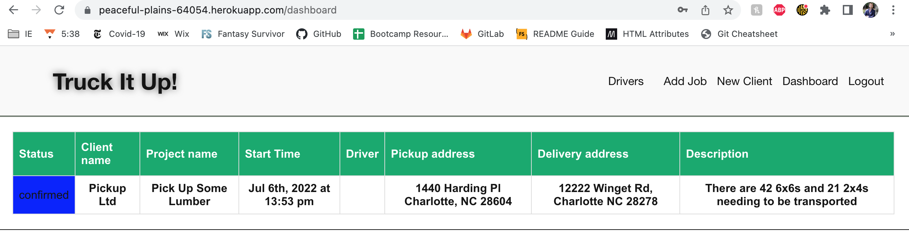
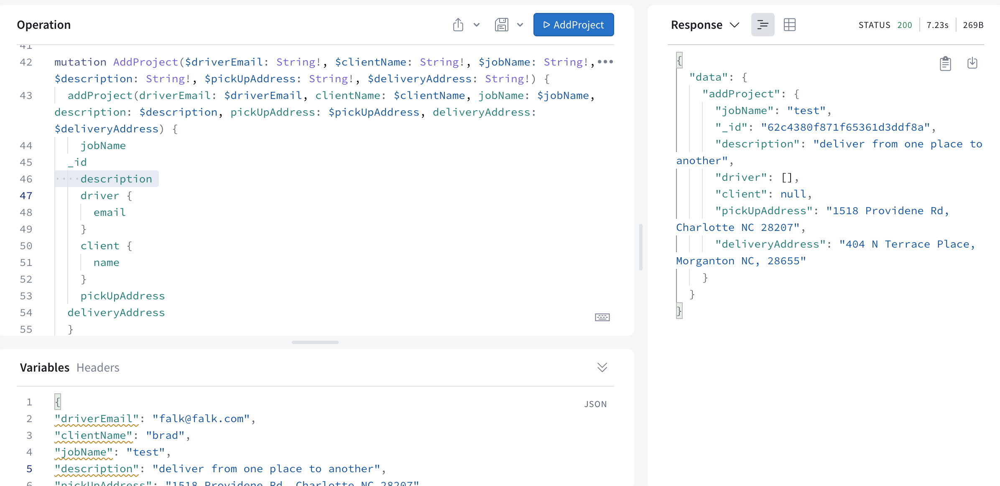
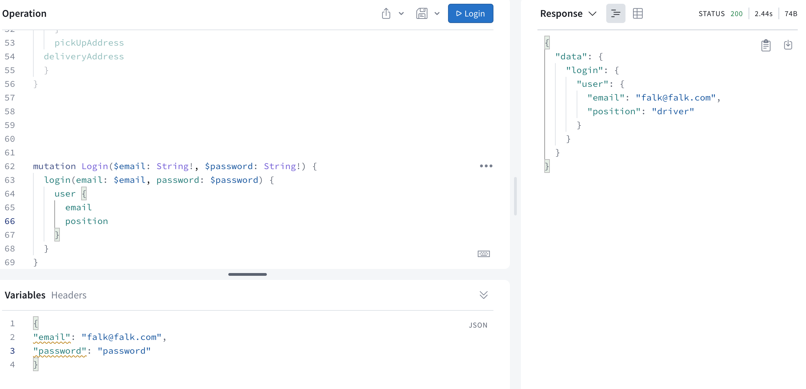

# trucked-up
Trucking app for creating and delegating jobs by Dispatchers to various truckers

        

## Table of Contents
- [Description](#description)
- [Installation](#installation)
- [Usage](#usage)
- [Credits](#credits)
- [Contributing](#contributing)
- [Tests](#tests)
- [Questions](#questions)
- [Additions](#additions)
- [License](#license)  
        

## Description
AS A dispatcher of many trucks,

I WANT to assign available truckers jobs.

SO THAT drivers understand their work assignment.

AS A trucker,

I WANT to view my assigned jobs in one location

SO THAT I can plan my next trip. 

Truck It Up is an app for trucking companies made to better organize information and communication from client to dispatcher to driver. When dispatchers sign in, they can keep track of incomplete jobs, confirmed jobs, completed jobs, and clients. They can also create jobs, and assign them to drivers. Drivers can sign on and accept the job and the confirm completion of the task. They can also view a map of the addresses. 

Completed, the program should operate such that:

WHEN I go to the repository

THEN I find that it meets quality coding standards and has a high-quality README

WHEN I look at the files on GitHub, 

THEN I see that React was used on the front end, GraphQL, Node.js, Express.js make up the server, and MongoDB and the Mongoose ODM were used for the database. 

WHEN I visit the website for the first time,

THEN I see that it is deployed to Heroku 

WHEN I click on the site, 

THEN I find that it is responsive and interactive (i.e., accept and respond to user input) with a polished UI.

WHEN I look at how the map the handles data,

THEN I see that authentication is used and sensitive API key information is protected.

WHEN I interact with elements,

THEN I can do things such as retrieving, adding, updating, and deleting data.

Work was divided in the following ways:

Matt: backend, models, schema
Will: wireframe, home page, addJob page, maps
Sergii: login & signin, dispatcher and driver dashboards
Rafael: client pages 

The biggest challenges came from the front end, such as getting the map to work and managing to display queries and implement mutations. 

## Installation

Links to the repository and the deployed page can be found at [Questions](#questions).

While this project's repository is available on Github, the site it deployed to Heroku. If you clone the repo you must run the command "npm install" on the Terminal/Command Line and download the dependencies, all of which are mentioned in [Credits](#credits).

## Usage

Once the project is cloned and the dependencies downloaded, type "npm start" to run the program. 

Screenshots of the program in action is shown below, at the dispatcher's dashboard with the newly-written job and the driver's dashboard whose job it was assigned to, and the dispatcher's dashboard again, showing the button on the driver side has been pressed confirmed the job. 

Screenshots of a successful add-project and login are shown to demonstrate the functionality through GraphQL 

## Credits

The coding boot camp Professional README Guide found at https://coding-boot-camp.github.io/full-stack/github/professional-readme-guide was used as a template for this README. The license was picked from [https://choosealicense.com/](https://choosealicense.com/).The WHEN/THEN section of this README was based off the project assignment Acceptance Criteria. Stack Overflow, MDN Web Docs, W3, and Google were critical to our success. The website icon was created by BZZRINCANTATION and downloaded from Flaticon. The home page image was taken by Pexels from Pixabay. PTV's API is used to convert addresses to coordinates and MapBox is used to render the map. Other npm packages used include react-copy-to-clipboard. 

## Contributing

If you make changes, test it locally on a branch before pushing to main. Clone from the github site and make sure to create your own .env file with your own credentials. Run "npm run dev" from the root folder to start both client and server sides. 

## Additions

First, refactoring is always welcome. It would be great to turn this project into a PWA so that drivers can update the completion of jobs with ease from wherever they may be. Allowing the map to show routes, to include a home (or work) address, travel time, and tolls, would greatly improve the map's overall use to the driver. Dispatcher-side improvements include the ability to edit projects and having a dropdown menu to choose amongst clients and drivers when adding jobs.

## Tests

No Jest tests written were made for this project, but GraphQL is a critical tool in letting you test the program's GET, POST, PUT, and DELETE methods. If you want to run tests, make sure the you have a MongoDB URI and a JWT Secret. 

## Questions

The github repository to this project is below:

[https://github.com/willjduncan/trucked-up.git](https://github.com/willjduncan/trucked-up.git)

The application is deployed on Heroku by Sergii, Matt, and Will. The site is below:

Matt's Site
[https://truck-it-up.herokuapp.com/](https://truck-it-up.herokuapp.com/)

Will's Site
[https://peaceful-plains-64054.herokuapp.com/](https://peaceful-plains-64054.herokuapp.com/)

Sergii's Site
[https://young-journey-90966.herokuapp.com/](https://young-journey-90966.herokuapp.com/)

For any additional questions, we can be reached at the following

Matt Teixeira: matt1teixeira@gmail.com
Github: [https://github.com/ApolloSolo](https://github.com/ApolloSolo)

Sergii Onyshchenko: twilight.cympak@gmail.com
Github: [https://github.com/sergiionyx](https://github.com/sergiionyx)

Will Duncan: willdunc12@gmail.com
Github: [https://github.com/willjduncan](https://github.com/willjduncan)

Rafael Dickerson: 

## License

[view license link here](https://choosealicense.com/licenses/mit/)

        
MIT License

Copyright (c) [2022]

Permission is hereby granted, free of charge, to any person obtaining a copy
of this software and associated documentation files (the "Software"), to deal
in the Software without restriction, including without limitation the rights
to use, copy, modify, merge, publish, distribute, sublicense, and/or sell
copies of the Software, and to permit persons to whom the Software is
furnished to do so, subject to the following conditions:

The above copyright notice and this permission notice shall be included in all
copies or substantial portions of the Software.

THE SOFTWARE IS PROVIDED "AS IS", WITHOUT WARRANTY OF ANY KIND, EXPRESS OR
IMPLIED, INCLUDING BUT NOT LIMITED TO THE WARRANTIES OF MERCHANTABILITY,
FITNESS FOR A PARTICULAR PURPOSE AND NONINFRINGEMENT. IN NO EVENT SHALL THE
AUTHORS OR COPYRIGHT HOLDERS BE LIABLE FOR ANY CLAIM, DAMAGES OR OTHER
LIABILITY, WHETHER IN AN ACTION OF CONTRACT, TORT OR OTHERWISE, ARISING FROM,
OUT OF OR IN CONNECTION WITH THE SOFTWARE OR THE USE OR OTHER DEALINGS IN THE
SOFTWARE.